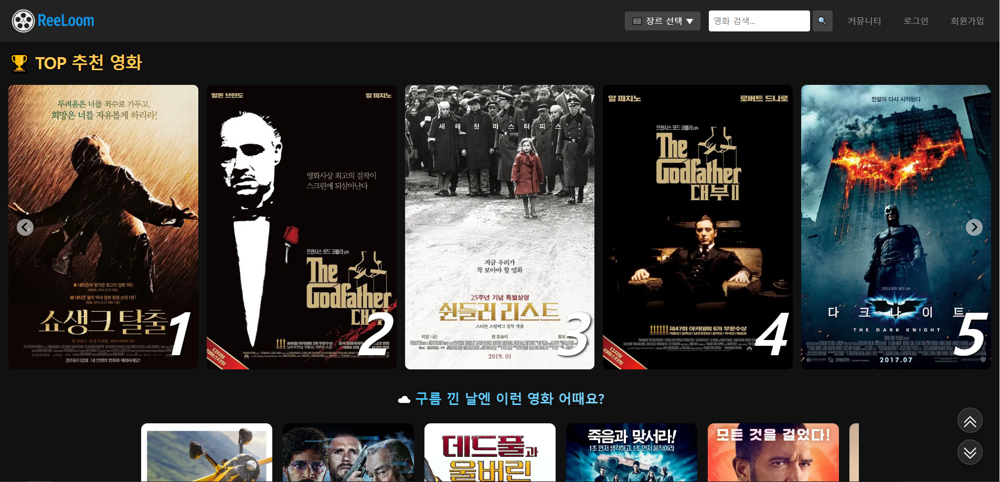
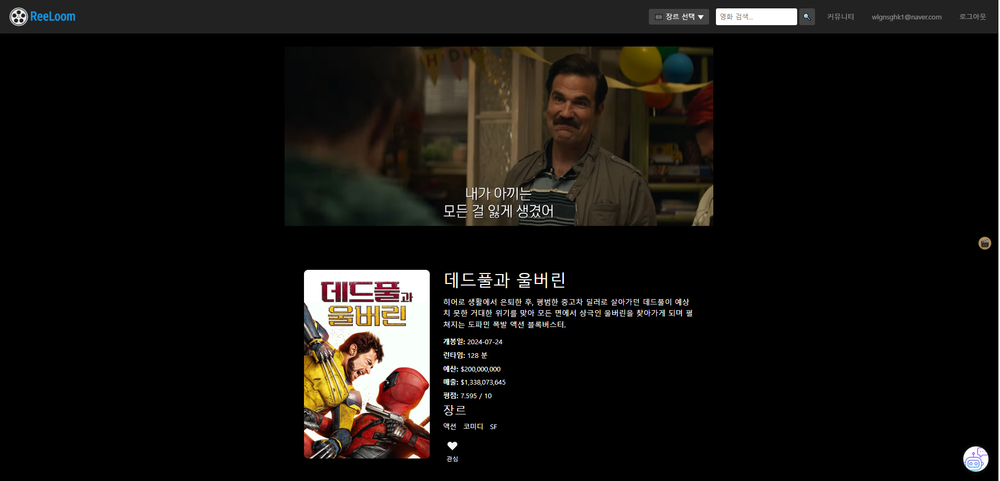
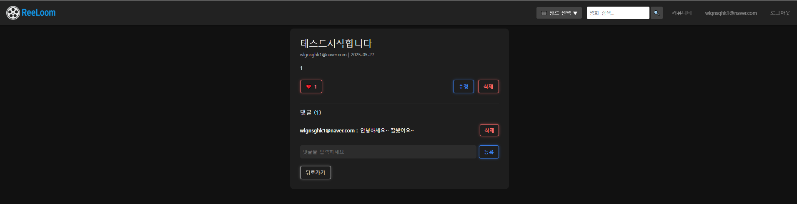
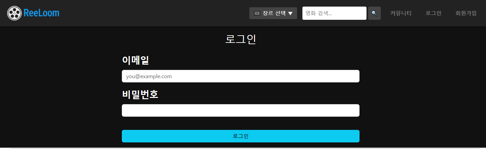
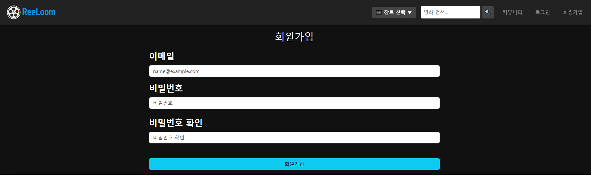
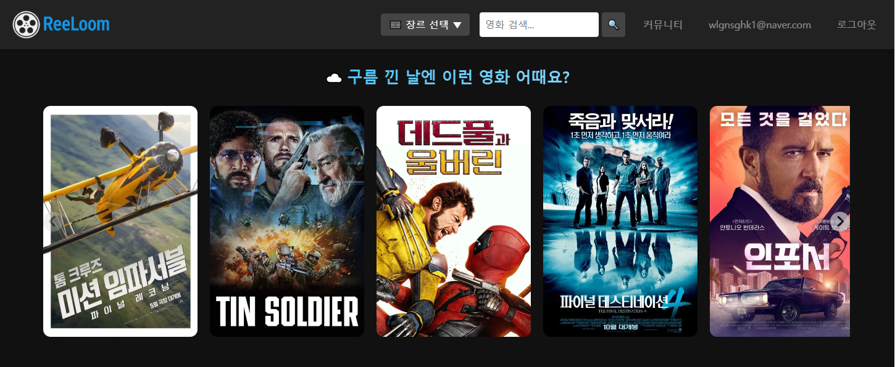
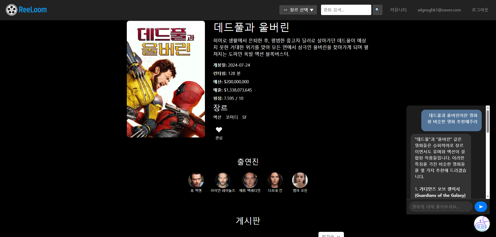
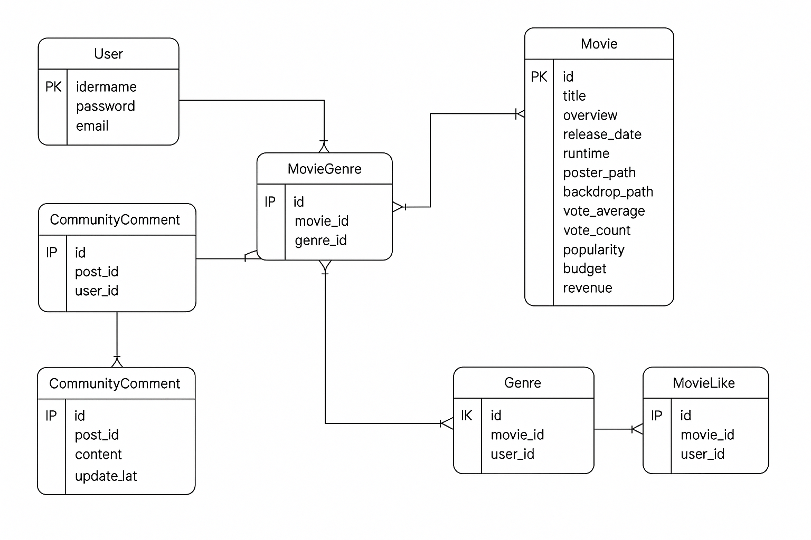

# 🎬 ReeLoom - 영화 추천 기반 커뮤니티 웹 서비스

## 👥 팀 소개
- **기우경** (팀장): 프론트엔드 개발, 추천 알고리즘 설계, 전반 구조 총괄
- **윤지훈** (팀원): 백엔드 개발, 커뮤니티 기능 구현, 데이터 모델링 및 API 설계

---

## 📌 프로젝트 개요

> **ReeLoom**은 사용자에게 다양한 방식으로 영화를 추천하고,  
> 커뮤니티에서 자유롭게 소통할 수 있는 영화 웹 서비스입니다.  
> TMDB 기반 영화 데이터를 활용하고, 날씨/평점 기반 추천 알고리즘과 생성형 AI 챗봇 기능을 포함합니다.

---

## 🛠 개발 환경 및 기술 스택

- **Frontend**: Vue 3, Pinia, Vue Router, Axios
- **Backend**: Django 4.2, Django REST Framework
- **Database**: SQLite3
- **API**: TMDB API, YouTube API, OpenAI GPT-4o
- **기타**: Python 3.9, Node.js LTS

---

### 📂 프론트엔드 디렉토리 구조 (frontend/src 기준)
```plaintext
src/
├── apis/               # axios 기반 API 호출 함수들
├── assets/             # 정적 자원
├── components/         # 공통 및 페이지별 컴포넌트
│   ├── common/         # 커뮤니티 관련 컴포넌트
│   ├── movie/          # 영화 관련 컴포넌트
│   ├── user/           # 유저 관련 (예: 모달)
│   └── youtube/        # 예고편 관련
├── router/             # Vue Router 설정
├── stores/             # Pinia 상태관리
├── views/              # 페이지 단위 Vue 파일
└── main.js             # 앱 진입점

```

---

## 🧱 프론트엔드 구조 및 주요 컴포넌트 설명

프로젝트는 **Vue 3 기반 SPA 구조**로 구성되었으며, View 단위 페이지와 다양한 재사용 컴포넌트로 나뉩니다.  
각 페이지는 상황에 맞는 컴포넌트를 조합하여 구성되어 있으며, 상태 관리는 **Pinia**를 사용합니다.

---


### 🖥️ 페이지(View)별 주요 컴포넌트 사용

#### 🏠 `IndexView.vue` (메인 페이지)
- **`RankedMovieCarousel.vue`**: 평점 상위 영화 캐러셀
- **`MovieCarousel.vue`**: 날씨 기반, 최신작, 인기 영화 캐러셀
- **`MovieCard.vue`**: 영화 카드 UI

#### 🎬 `MovieDetailView.vue` (영화 상세 페이지)
- **`MovieDetailInfo.vue`**: 개요/장르/예산/매출/평점 등 영화 정보
- **`MovieChatBot.vue`**: GPT-4o 기반 생성형 AI 챗봇
- **`MovieArticleCard.vue`, `MovieArticleCardModal.vue`**: 관련 커뮤니티 글/모달
- **`YoutubeTrailerModal.vue`**: 예고편 재생 모달
- **`MovieCard.vue`**: 하단 추천 영화 목록 카드

#### 💬 `CommunityView.vue` (커뮤니티 목록)
- **`CommunityComment.vue`**: 커뮤니티 댓글
- **`CommunityPoseCard.vue`**: 커뮤니티 목록 카드

#### 📝 `CommunityDetailView.vue` (커뮤니티 상세)
- **`MovieArticleCard.vue`**: 게시글 본문 표시
- **`MovieArticleComment.vue`**: 댓글 출력
- **`MovieArticleInput.vue`**: 댓글 입력창

#### 🆕 `CommunityCreateView.vue`, `CommunityEditView.vue`
- **`CommunityPostForm.vue`**: 게시글 작성/수정 폼

#### 🔐 `UserLoginView.vue`, `UserLoginView.vue`, `UserSignupView.vue`
- **`UserLogin.vue`**: 사용자 로그인
- **`UserLogout.vue`**: 사용자 로그아웃
- **`UserSignUp.vue`**: 사용자 회원가입

#### 🔍 `SearchView.vue`
- **`MovieCard.vue`**: 검색 결과 출력

#### 🎯 `GenreMoreView.vue`, `RecommendedView.vue`
- **`MovieCard.vue`**: 장르별 추천 영화 출력


## 🛠 백엔드 구조 및 주요 기능 설명

Django 4.2와 Django REST Framework를 기반으로 백엔드를 구성하였으며,  
**영화**, **유저**, **커뮤니티**, **영화 추천 알고리즘**, **AI 챗봇 API** 등 기능별로 앱을 나누어 설계했습니다.

---

### 📂 주요 앱 구성

#### 1. `movies` 앱
- **주요 모델**
  - `Movie`: 영화 정보 (제목, 줄거리, 개봉일, 포스터 등)
  - `Genre`: 장르 (액션, 드라마 등)
  - `MovieGenre`: 다대다 관계 테이블
  - `MovieLike`: 영화 좋아요 관계
  - `CommunityPost`: 게시글
  - `CommunityComment`: 댓글
  
- **기능**
  - 영화 목록, 상세 정보 조회
  - 평점 기반 추천, 날씨 기반 추천
  - 게시글 CRUD
  - 댓글 CRUD
  - 좋아요 기능
- **URLS**
  - `/api/movies/`: 영화 전체 목록
  - `/api/movies/<pk>/`: 영화 상세
  - `/api/movies/weather/`: 날씨 기반 추천
  - `/api/movies/top-rated/`: 평점 기반 추천
  - `/api/community/`: 전체 게시글
  - `/api/community/<pk>/`: 게시글 상세
  - `/api/community/<post_id>/comments/`: 댓글 목록
  - `/api/community/<post_id>/like/`: 좋아요 토글


#### 3. `final_pjt_back` 유저모델(프로젝트) 
- **주요 모델**
  - `User`: 사용자 (커스텀 유저 모델)
- **기능**
  - 회원가입 / 로그인 / 로그아웃
  - 유저 프로필 / 관심 영화 관리
- **URLS**
  - `/api/users/signup/`
  - `/api/users/login/`
  - `/api/users/<user_id>/profile/`
  - `/api/users/<user_id>/likes/`

#### 4. `chatbot` (or GPT API 호출 로직)
- **기능**
  - GPT-4o API를 이용한 질문-응답 처리
- **URLS**
  - `/api/chat/ask/`: 프론트에서 질문을 보내면 GPT 답변 반환

---

### 🔗 기술 포인트 요약

- 모든 API는 Django REST Framework 기반으로 **RESTful하게 설계**
- 인증은 JWT 혹은 TokenAuth 기반 (상세 설정에 따라)
- `fixtures/` 디렉토리를 통해 **약 2,000개의 영화 데이터**를 초기 등록 가능
- 챗봇 기능은 OpenAI API 연동을 통해 **실시간 질문 응답 가능**

---

### 🔁 예시 응답 형식 (영화 추천 API)
```json
[
  {
    "id": 12,
    "title": "쇼생크 탈출",
    "poster_path": "/abc.jpg",
    "vote_average": 9.3,
    "overview": "희망에 대한 감동 이야기"
  }
]
```
## 🎯 주요 기능

### 1. 메인페이지
- Top Rated 영화 캐러셀
- 날씨 기반 추천 영화 섹션
- 영화 검색 기능

> 

---

### 2. 영화 상세 페이지
- 예고편 영상 (YouTube)
- 포스터, 줄거리, 개봉일, 런타임, 평점, 매출, 예산 등 상세 정보
- 관심 등록 버튼

> 

---

### 3. 커뮤니티 기능
- 게시글 생성, 수정, 삭제
- 댓글 작성, 삭제
- 좋아요 기능

> 

---

### 4. 인증 기능
- 회원가입 / 로그인 / 로그아웃

>   
> 

---

### 5. 추천 알고리즘

#### ☀️ 날씨 기반 추천
- 현재 날씨와 연관된 장르를 선택하여 영화 추천

> 

#### ⭐ 평점 기반 추천
- TMDB 평점 기준 Top 10 영화 자동 추천

---

### 6. 생성형 AI 챗봇 기능
- 영화 관련 대화를 GPT-4o와 실시간으로 수행
- 예: “데드풀과 울버린과 비슷한 영화 추천해줘”

> 

---

## 🧩 데이터 및 ERD

- 약 **2,000개 이상의 영화 데이터를 TMDB API**로 수집 및 fixtures 구성
- Django ORM 기반 모델 설계 및 관계 정의

> 

---

## 📦 폴더 구조 (일부 생략)
```plaintext
09-pjt/
├── frontend/
│   ├── assets/
│   ├── components/
│   ├── views/
│   └── store/
├── backend/
│   ├── movies/
│   ├── community/
│   └── final-pjt-back/
└── fixtures/
```


## 📝 느낀점

###  기우경 (팀장)
Vue와 Django를 처음 연결할 때는 막막했지만, 실제 사용자 경험을 고려해 UI를 하나하나 개선해나가는 과정이 매우 재미있고 보람찼습니다.  
특히 캐러셀 구성, 반응형 디자인, 날씨 기반 추천 알고리즘 구현 과정에서 프론트엔드와 백엔드 간의 데이터 흐름을 직접 설계하며 실력을 키울 수 있었습니다.  
GPT-4o를 활용한 챗봇도 처음엔 단순한 기능이었지만, 사용자 맞춤형 경험이라는 측면에서 확장 가능성을 확인할 수 있어 의미 있었습니다.

---

###  윤지훈 (팀원)
이번 프로젝트에서는 Django와 DRF를 본격적으로 다루며 백엔드의 전반적인 흐름을 체계적으로 익힐 수 있었습니다.  
특히 커뮤니티 기능에서 게시글/댓글/좋아요 모델링과 시리얼라이저 설계, API 처리 등을 모두 직접 구현하면서 구조화된 백엔드의 중요성을 크게 느꼈습니다.  
프론트엔드와 RESTful API로 소통하며 자연스럽게 협업 흐름도 익혔고, fixtures를 이용한 대규모 데이터 구축 경험도 실무와 유사한 느낌이었습니다.  
팀원과의 원활한 소통과 역할 분담 덕분에 전체적인 퀄리티가 높아졌다고 생각합니다.


